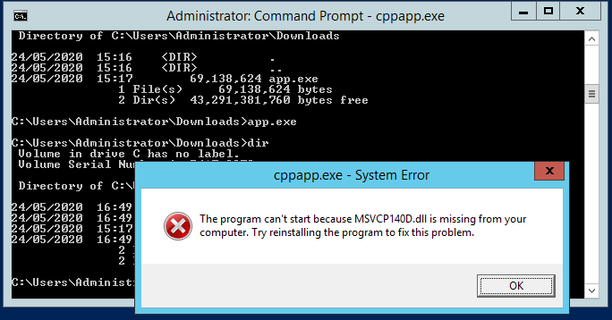
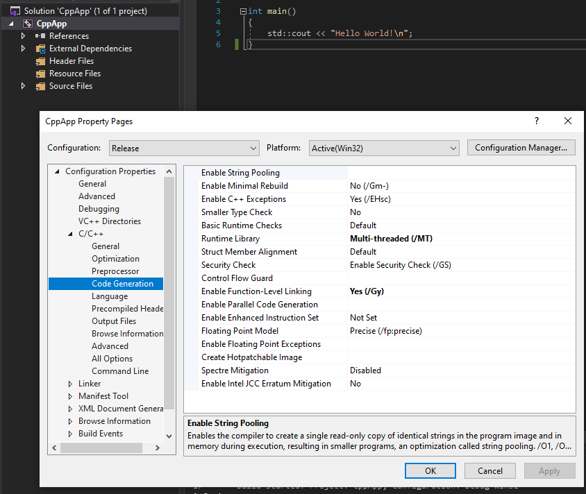



## Standalone C++ Apps
Need to use static linking to prevent the target needing the runtime installed:

To overcome this, statically link the application. In VisualStudio, right-clink the project and go to `Configuration Properties > Code Generation > C/C++` and change `Runtime Library` to `/MT` for release, and `/MTd` for debug:

The app should now run self-contained on a target that does not have the runtime installed.

