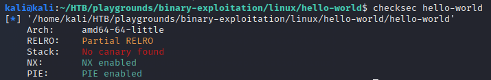
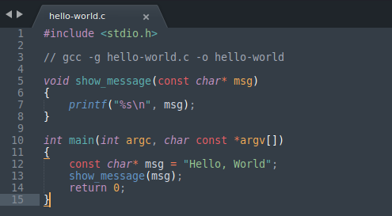



*This isn't intended as a tutorial for others, only a reminder to me. As such it's likely to be incomplete.*

## References

[GDB Tutorial](https://web.eecs.umich.edu/~sugih/pointers/summary.html)

[Peda](https://github.com/longld/peda)

[GDB](https://visualgdb.com/gdbreference/commands/)

## Basics
### Evaluating a binary

|Command|Description|
|:---|:---|
|`file`|Show file details.|
|`strings`|Show printable character sequences.|
|`readelf`|Show details for an `elf` file.|
|`ldd`|Show shared-object dependencies.|
|`binwalk`|Search for embedded files or executable code.|
|`checksec`|Show security measures.|
|`ltrace`|Trace library calls.|
|`strace`|Trace system calls.|
|`objdump`|Show disassembly.|
|`nm`|Show symbols.|


### Using checksec
Output for `checksec` looks something like this:



## GDB
To make GDB more user friendly (colourised output, additional functionality and commands), install `peda`:
```
git clone https://github.com/longld/peda.git ~/peda
echo "source ~/peda/peda.py" >> ~/.gdbinit
```

### GDB Command Reference

|Command|Description|
|:---|:---|
|**Getting started**||
|`gdb`|Start `GDB` without spedifying a file (use the `file` command to load a file).|
|`gdb file-to-debug`|Start `GDB` using the file `file-to-debug`.|
|`(f)ile file-to-debug`|Specify the name of the file to debug.|
|`(r)un`|Start debugging the specified file.|
|`(r)un arg1 arg2`|Start debugging the specified file and pass `arg1` and `arg2` to the executable.|
|**Getting help**||
|`(h)elp`|Show the help menu.|
|`(h)elp breakpoints`|Show help for the `breakpoints` topic.|
|`(h)elp tbreak`|Show help for the `tbreak` command.|
|``||
|``||
|``||
|**Breakpoints**||
|`(b)reak main`|Set a breakpoint on function `main`.|
|``||
|``||
|``||
|`info breakpoints`|List breakpoints.|
|``||
|``||
|`(del)ete`|Delete all breakpoints.|
|``||
|``||
|``||
|``||
|``||
|`(disas)semble`|Show disassembly (break and then issue command, see reference for more).|
|`(disas)semble show_message`|Show disassembly for function `show_message`.|
|`(disas)semble 0x555555555135`|Show disassembly for function at address `0x555555555135`.|
|``||
|``||
|``||
|``||
|``||
|``||
|``||
|``||
|``||
|`(q)uit`|Quit `GDB`.|

### Peda Command Reference

|Command|Description|
|:---|:---|
|`aslr`|Check `aslr` status for the binary.|
|`checksec`|Check the security options for the binary.|
|``||
|``||
|``||
|``||
|``||
|``||
|``||
|``||
|``||
|``||
|``||
|``||
|`reg` or `xinfo registers`|Print registry information.|
|``||
|``||
|``||
|``||
|``||
|``||
|``||
|``||

## Return to libc / Return Oriented Programming (ROP)
When to use `return to libc`:
- Buffer causing overflow is too small for a `nop sled/shellcode` attack


Show memory location the binary resides at and also the `libc` addresses.
```
cat /proc/self/maps
```


Piping Python print into binary (use backticks or `$`). Wrap the command substitution in `"` to prevent `python` interrupretting raw bytes:
```
./overflow "`python3 -c "print('i' * 100)"`"
./overflow "$(python3 -c "print('i' * 100)")"
```
 


 ```c
 // Compile with: gcc -g hello-world.c -o hello-world
 #include <stdio.h>

void show_message(const char* msg)
{
	printf("%s\n", msg);
}

int main(int argc, char const *argv[])
{
	const char* msg = "Hello, World";
	show_message(msg);
	return 0;
}
 ```